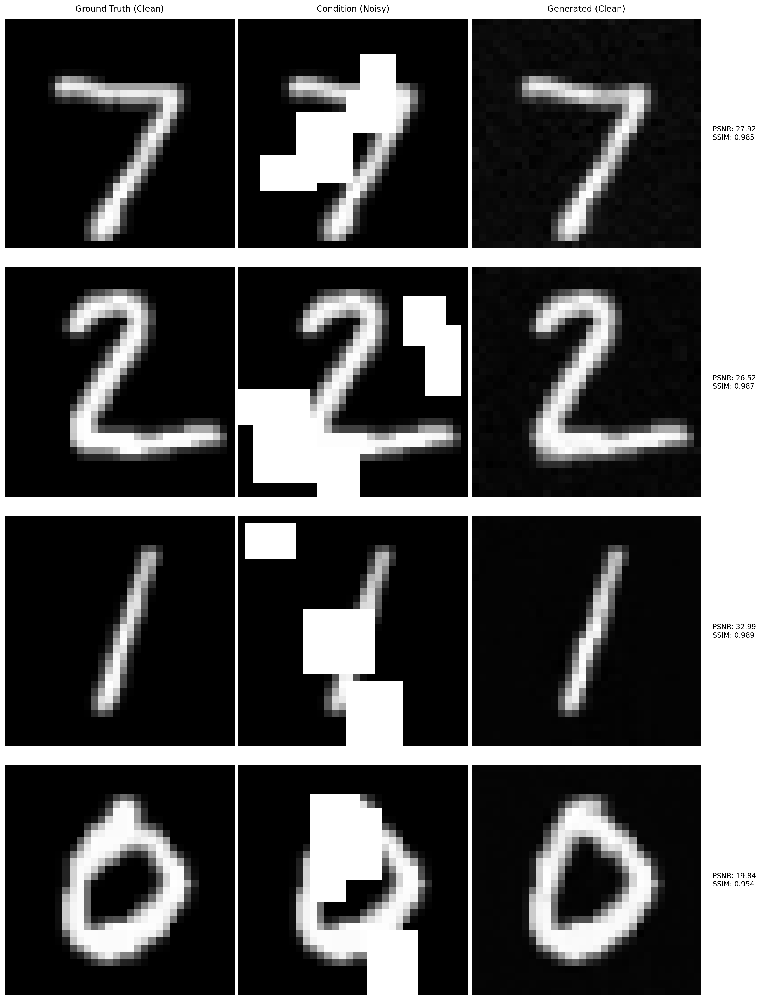

[](https://doi.org/10.5281/zenodo.14047997)
# Diffusion Cleaner

Diffusion Cleaner is the implementation of conditional diffusion models designed for image artifact removal. This repo demonstrates how to train and use diffusion models to clean images by conditioning on corrupted images.


*Figure 1: Examples of image restoration using conditional diffusion model.*

## Environment

```bash
conda env create -f environment.yml
conda activate diffusion-cleaner
```

## Usage

```bash
git clone https://github.com/sypsyp97/diffusion-cleaner.git
cd diffusion-cleaner
python example.py
```

## License

This project is licensed under the MIT License - see the [LICENSE](LICENSE) file for details.
