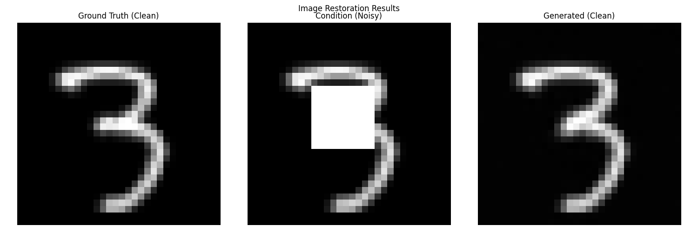

# Diffusion Cleaner

Diffusion Cleaner is a toy implementation of conditional diffusion models designed for image artifact removal. This repo demonstrates how to train and use diffusion models to clean images by conditioning on corrupted versions containing artifacts.



## Usage

```bash
git clone https://github.com/yourusername/diffusion-cleaner.git
cd diffusion-cleaner
python example.py
```
