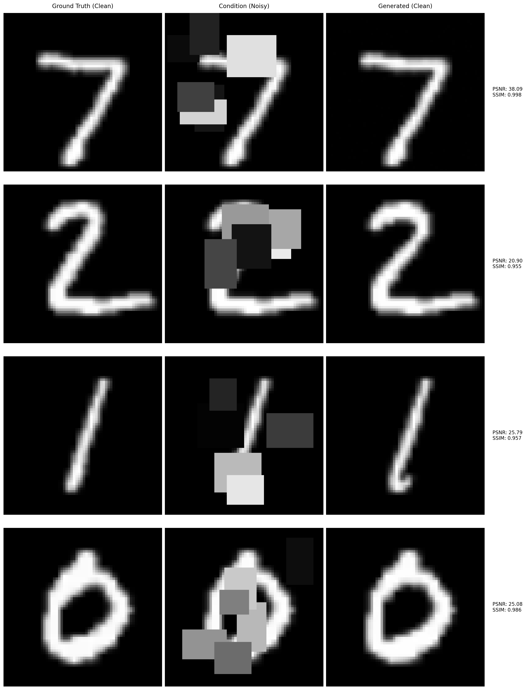

[](https://doi.org/10.5281/zenodo.14047997)

This repository implements conditional diffusion models for image artifact removal. It demonstrates how to train and utilize diffusion models to remove artiifacts by conditioning on corrupted images.


*Figure 1: Examples of image restoration using conditional diffusion models.*

## Environment

```bash
conda env create -f environment.yml
conda activate diffusion-cleaner
```

## Usage

```bash
git clone https://github.com/sypsyp97/conditional_diffusion_model.git
cd conditional_diffusion_model
python example.py
```

## License

This project is licensed under the MIT License - see the [LICENSE](LICENSE) file for details.
